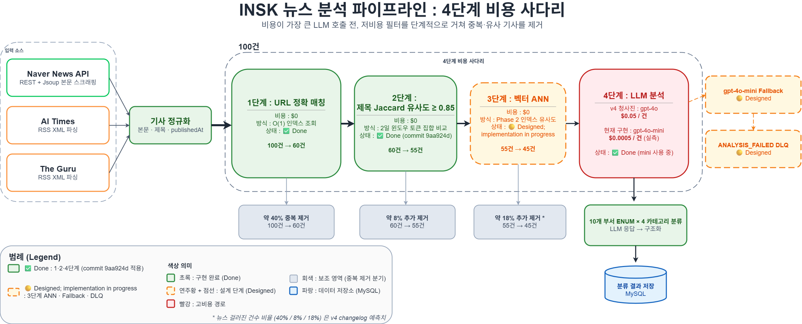

# INSK : News Intelligence Platform

> A Spring Boot 3 / Next.js 15 platform that collects articles from 3 external news sources, runs OpenAI analysis and embedding, and recommends the most relevant articles per department for 10 SK departments.
>
> **Backend work that does not stop at feature delivery, but redesigns the system from the angles of operations, classification correctness, and scalability.** After v3 was deployed on AWS Elastic Beanstalk, 9 senior code review items from an SKT engineer drove a v4 cost and reliability rearchitecture (in progress).

🎬 [Demo video](https://www.youtube.com/watch?v=WlKGbvbxHik) · 🇰🇷 [Korean README](README.md) · 📜 [v3 snapshot](README_v3_legacy.ko.md)

---

## Project Summary

| Item | Detail |
|---|---|
| One line | Collect from 3 news sources (Naver News API · AI Times RSS · The Guru RSS), OpenAI analysis, classify into 10 department ENUM × 4 categories, deliver per-department Top-5 |
| Period | 2025.07.01 ~ ongoing |
| Role | Team Lead (started in SK mySUNI Sunny-C cohort 4, sole owner from v3 onward) |
| Stack | Java 21 · Spring Boot 3.5.6 · MySQL 8 · Next.js 15 · OpenAI GPT-4o · text-embedding-3-small · AWS Elastic Beanstalk · GitHub Actions |
| Status | v3 deployed on AWS EB; v4 cost ladder stages 1·2·4 in code; stage 3 ANN, Fallback and DLQ at design stage |
| Key asset | [MENTOR_FEEDBACK_CHANGELOG.md](MENTOR_FEEDBACK_CHANGELOG.md) ｜ 1:1 mapping from 9 SKT senior review items to v4 redesign |

### Data Flow (v3 + v4 Cost Ladder)



---

## What Problem Is This Solving

IT/AI staff across SK's 10 departments manually clip, dedupe and summarise industry news every day. As of 2024 SK affiliate staff reportedly spent **about 1.5 hours per day, 7~8 hours per week** on news clipping; in 2025 some teams downgraded the activity to once a week. Manual cost was eating into strategic work.

INSK automates this collection and analysis loop and returns only articles that are genuinely relevant to each department. Because classification, summarisation and recommendation all run on LLM calls, two engineering challenges follow.

1. **Cost**: keep per-LLM-call unit cost low enough to make the system economically viable at organisation scale.
2. **Reliability**: make sure a single LLM API failure does not drop an article completely; preserve fallback and reprocess paths.

### Version Evolution

| Version | Period | Stack | Status |
|---|---|---|---|
| v1 (Sunny-C) | 2024 | Make + Streamlit | In-house PoC |
| v2 (Phase 2) | 2025 H1 | Python + Streamlit | Operational validation |
| **v3** | 2025.07 ~ 2026.04 | **Spring Boot 3 + Next.js 15**, AWS EB + GitHub Actions ECR, daily 08:00 cron, OpenAI analysis + embedding + per-department Top-5 | Deployed on AWS |
| **v4** | 2026.05 ~ ongoing | Absorbing 9 SKT senior review items on top of v3: 4-stage cost ladder (URL · Title Jaccard 0.85 · Vector ANN · GPT-4o), `@Transactional` scope split, Redis MD5 prompt caching | Stages 1·2·4 Done / Stage 3, Fallback, DLQ Designed |

### Core Contributions (Gunwoo Park)

1. **Classification correctness recovery**: gpt-4o-mini was tagging LLM articles as AI Business, causing a 71% skew to one category. Redesigned the 4-category definitions (LLM · INFRA · Telco · AI Business) and the boundaries between them, rebuilt the SYSTEM_PROMPT, and ran a DB migration to restore balance.
2. **v4 4-stage cost ladder design**: turned 9 SKT senior review items into PR-shaped work, splitting the pipeline into URL → Title Jaccard 0.85 → Vector ANN → GPT-4o so that the expensive LLM call only sees genuinely new articles.
3. **Joint redesign of LLM cost and reliability**: externalised models (analysis / simple / embedding), designed fallback (gpt-4o → gpt-4o-mini), and a DLQ state machine (ANALYSIS_FAILED + separate reprocess).

---

## Key Measurements

### v3 Operational Measurement (gpt-4o-mini, measured 2026-05)

| Metric | Value | Source |
|---|:---:|---|
| Cumulative articles | ~320 | DB inspection (2026-05-24) |
| OpenAI cumulative cost | $0.19 | OpenAI usage, 4 trigger runs |
| **Per-article unit cost (gpt-4o-mini)** | **~$0.0005** | usage page / new article count |
| Daily collection (avg) | 30~80 | average of 4 trigger runs |

### v4 Classification Recovery (taxonomy redesign, 2026-05-22)

| Category | Before migration | After migration | Change |
|---|:---:|:---:|:---:|
| AI Business (formerly AI Ecosystem) | 71% | **55%** | **-16%p relaxed** |
| LLM | 4% | **20%** | **5x recovered** |

> Ran a SQL query on classification distribution, found the 71% skew, redesigned category definitions and boundary rules, rebuilt the SYSTEM_PROMPT, and reclassified 36 articles via SQL migration. HTTP codes and JSON schemas were all "fine"; the failure was semantic.

### Cost Ladder Expected Effect (v4 blueprint, not yet measured)

| Stage | Cost | Filter rate (predicted) |
|:---:|:---:|:---:|
| 1. URL exact match | $0 | ~40% |
| 2. Title Jaccard ≥ 0.85 | $0 | ~8% |
| 3. Vector ANN | ~$0 | ~18% |
| 4. GPT-4o (or gpt-4o-mini) | $0.05 / $0.0005 | only articles that pass 1~3 |

> Filter rates are predicted figures from [MENTOR_FEEDBACK_CHANGELOG.md](MENTOR_FEEDBACK_CHANGELOG.md). Real measurements will be added after stage 3 ANN implementation and load testing.

---

## Architecture

### v3 Data Flow (deployed)

```
3 news sources
  Naver News API  (REST + Jsoup body scrape)
  AI Times        (RSS XML parse)
  The Guru        (RSS XML parse)
        │
        ▼
Spring Boot 3.5.6 (Java 21)
  NewsPipelineService (@Async)
    collect → OpenAI analysis → embed → score
  Spring Security + JWT (1h TTL)
  Per-department Top-5 recommendation
        │
        ▼
MySQL 8.0
  users · keywords · articles · article_analyses
  article_embeddings · article_feedbacks · article_scores
        │
        ▼
Next.js 15.5.4 (App Router) + Tailwind CSS 4
  / · /articles/[id] · /keywords · /departments · /favorites

Deploy: GitHub Actions → AWS ECR → Elastic Beanstalk
       (multi-stage Dockerfile · EB Ready-state polling guard)
```

### v4 Cost Ladder

```
new article in
    │
    ▼ Layer 1 ｜ URL exact match           ($0)               ✅ Done
    │  O(1) DB index lookup
    ▼ Layer 2 ｜ Title Jaccard ≥ 0.85      ($0)               ✅ Done
    │  2-day window + token set comparison
    ▼ Layer 3 ｜ Vector ANN                 (~$0)              🟡 Designed
    │  embed once, pre-indexed
    ▼ Layer 4 ｜ GPT-4o (or mini)           ($0.05 / $0.0005)  ✅ Done
       only articles that pass 1~3

Failure handling (both 🟡 Designed)
    LLM failure → gpt-4o-mini Fallback
    Fallback failure → ANALYSIS_FAILED state + separate reprocess
```

---

## Implemented

- **v3 in production**: AWS Elastic Beanstalk deploy, GitHub Actions ECR pipeline, 3-source collection, GPT-4o analysis + embedding, per-department Top-5 recommendation, JWT auth, likes/feedback, PDF export
- **v4 partial**: cost ladder stages 1·2·4 (URL match + Title Jaccard + LLM call), OpenAI model externalisation (analysis / simple / embedding), taxonomy redesign (AI Ecosystem → AI Business + strengthened LLM definition), thresholds and dedup window externalised to application.properties

---

## Designed / In Progress

- **v4 cost ladder stage 3**: Vector ANN (FAISS or HNSW index under evaluation)
- **Retry + fallback**: `@Retryable(maxAttempts=5, backoff=@Backoff(delay=1000, multiplier=2.0))` + `@Recover` smaller-model fallback
- **DLQ mechanism**: ANALYSIS_FAILED state + separate reprocess job
- **Transaction scope split**: extract ArticleSaveService so external API calls live outside the DB connection
- **Redis CacheManager**: article body MD5 key prompt caching, distributed cache consistency
- **Keyword parallelisation**: introduce `CompletableFuture.runAsync`

---

## Roadmap

### v4 implementation
- [x] Cost ladder stages 1·2 (URL + Title Jaccard)
- [x] OpenAI model externalisation (analysis / simple / embedding)
- [x] Taxonomy redesign (AI Business + strengthened LLM definition)
- [x] Threshold + dedup window externalisation
- [ ] Cost ladder stage 3 (Vector ANN)
- [ ] `@Retryable` + `@Recover` fallback
- [ ] DLQ mechanism (ANALYSIS_FAILED + separate reprocess)
- [ ] Transaction scope split
- [ ] Redis CacheManager (distributed cache)
- [ ] Keyword parallelisation (`CompletableFuture.runAsync`)

### v4 validation
- [ ] Real-operation cost ladder measurement (currently predicted only)
- [ ] retry / fallback chaos test

---

## Tech Stack

| Area | Stack |
|---|---|
| Backend (v3) | Spring Boot 3.5.6 · Java 21 · Gradle · Spring Data JPA · Hibernate · MySQL 8.0 · Spring Security · jjwt 0.12.x · BCrypt · Jsoup 1.17.2 · Spring WebFlux · PDFBox 2.0.30 · iText 7.2.5 · `@Async` ThreadPoolTaskExecutor |
| Backend (v4 planned) | Spring Retry · Resilience4j · RedisCacheManager |
| Frontend | Next.js 15.5.4 (App Router) · React 19.1 · TypeScript 5 · Tailwind CSS 4 · Axios |
| AI / Data | OpenAI GPT-4o (article analysis) · text-embedding-3-small (semantic embedding) · gpt-4o-mini (low-cost branch) |
| Infrastructure | AWS Elastic Beanstalk (ap-northeast-2) · AWS ECR (multi-stage Docker) · GitHub Actions (test → build → ECR push → S3 → EB deploy with Ready-state polling) |

---

## Role and Ownership

| Area | What I did |
|---|---|
| System design | Integration of 3 news sources + 3 OpenAI APIs, normalisation around 10 department ENUM × 4 categories |
| Backend impl | Spring Boot pipeline (collect → analyse → embed → score), JWT auth, per-department Top-5 algorithm |
| AI integration | GPT-4o classification + text-embedding-3-small + cosine similarity scoring + 5-layer GPT output validation |
| Deploy / Ops | AWS EB + GitHub Actions ECR pipeline, daily collection cron operation |
| Review absorption | Organised 9 SKT senior review items into a matrix, wrote the v4 refactor plan, landed parts of it in code |

> Team lead: started in SK mySUNI Sunny-C cohort 4 for v1/v2. From v3 onward I have been driving the work solo.

---

## How to Run Locally

### Prerequisites
- Java 21
- MySQL 8.0 (database: `insk_db`)
- OpenAI API Key
- Naver Developers Client ID / Secret

### 1. Backend

```bash
cd insk-backend/backend
# write application.properties (see BACKEND_SETUP_GUIDE.md)
./gradlew bootRun
# Windows: .\gradlew.bat bootRun
```

### 2. Frontend

```bash
cd insk-frontend
npm install
# .env.local with NEXT_PUBLIC_API_BASE_URL=http://localhost:8080
npm run dev
```

### 3. Trigger the pipeline (PowerShell)

```powershell
# login, get token
$body = @{ email = "your-email"; password = "your-password" } | ConvertTo-Json
$token = (Invoke-RestMethod "http://localhost:8080/api/v1/auth/login" -Method POST -ContentType "application/json" -Body $body).accessToken

# trigger collection + analysis (async, 2~5 min)
Invoke-RestMethod "http://localhost:8080/api/v1/articles/run-pipeline" `
  -Method POST -Headers @{ Authorization = "Bearer $token" }
```

Scheduled run: `@Scheduled(cron = "0 0 8 * * *")`, daily 08:00 KST.

---

## In-Repo References

- [MENTOR_FEEDBACK_CHANGELOG.md](MENTOR_FEEDBACK_CHANGELOG.md) ｜ 9 SKT senior review items → v4 redesign, 1:1 mapping
- [PROJECT_SPECIFICATION.md](PROJECT_SPECIFICATION.md) ｜ Functional spec
- [insk-backend/BACKEND_SETUP_GUIDE.md](insk-backend/BACKEND_SETUP_GUIDE.md) ｜ Local environment setup
- [README.md](README.md) ｜ Korean master
- [README_v3_legacy.ko.md](README_v3_legacy.ko.md) ｜ v3 snapshot

---

## Contact

**Gunwoo Park ｜ Backend Engineer (Sangmyung University, Software, 4th year, graduating 2027.02)**

- Email: gunwoo363@gmail.com
- GitHub: [github.com/gm-15](https://github.com/gm-15)
- Blog: [velog.io/@gm-15](https://velog.io/@gm-15)
