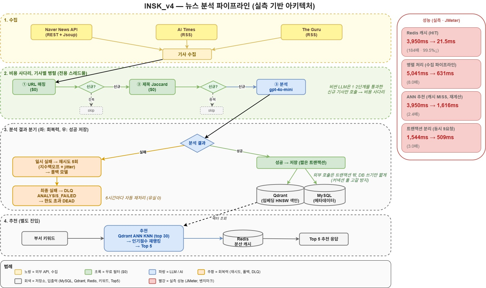

# INSK : 뉴스 인텔리전스 플랫폼

> 3개 외부 뉴스 소스에서 기사를 수집해 OpenAI 분석, 임베딩을 거쳐, SK 10개 부서별로 가장 관련성 높은 기사를 추천하는 Spring Boot 3 / Next.js 15 플랫폼.
>
> **문제를 기능 구현으로 끝내지 않고, 운영, 정합성, 확장성 관점에서 다시 설계하는 백엔드 작업.** v3를 AWS EB에 배포한 뒤 SKT AI Data 시니어의 코드 리뷰 9건을 받아, v4에서 **9건 전부를 코드로 반영하고 효과를 수치로 측정**했다.

🎬 [Demo 영상](https://www.youtube.com/watch?v=WlKGbvbxHik), 🇬🇧 [README.en.md](README.en.md), 🧭 [기술 의사결정 기록](docs/TECHNICAL_DECISIONS.md), 📊 [벤치마크](docs/benchmark/), 📜 [v3 보존본](archive/README_v3_legacy.ko.md)

> 🎓 **관련 사이드 연구**: [INSK-trend-forecast](https://github.com/gm-15/INSK-trend-forecast) — 한국어 AI 뉴스 RAG 검색, 추천 성능을 Precision@k, nDCG로 측정한 시계열 수업 팀 프로젝트. 그 측정 습관을 INSK 추천 검증에 적용했다.

---

## 한눈에 보는 성과 (v4, 전부 실측, 산출물 커밋)



| 작업 | Before → After | 개선 |
|---|---|---|
| **Redis 분산 캐시** (#9) | 부서 추천 응답 3,950ms → **21.5ms** (p95 4,384 → 40ms) | **약 99.5% 단축 (184배)** |
| **기사별 병렬화** (#4) | 수집 처리 5,041ms → **631ms** | **약 87.5% 단축 (8.0배)** |
| **ANN(VectorDB) 추천** (#1) | 추천 재계산 3,950ms → **1,616ms** | **약 59% 단축 (2.4배)** |
| **트랜잭션 분리** (#3) | 제약 풀 동시 9요청 1,544ms → **509ms** | **약 67% 단축 (3.0배)** |
| **분류 정합성 회복** | 한쪽 카테고리 쏠림 71% → **55%** / LLM 4% → **20%** | **-16%p / 5배 회복** |
| **부서 추천 silent failure** | 추천 점수 전 부서 0점 → **10/10 부서 정상** | 측정으로 발견, 수정 |

> 모든 성능 수치는 JMeter, 재현 가능한 벤치마크로 측정해 `.jmx`, 결과, 산출물을 [`docs/benchmark/`](docs/benchmark/)에 커밋했다.

---

## 프로젝트 요약

| 항목 | 내용 |
|---|---|
| 한 줄 | 3개 뉴스 소스(Naver News API, AI Times RSS, The Guru RSS) 수집, OpenAI 분석, 10개 부서 ENUM × 4 카테고리 분류, 부서별 Top-5 추천 |
| 활동 기간 | 2025.07.01 ~ 2026.06 (단계적 진화, 아래 버전 표) |
| 역할 | SK mySUNI 써니C 4기 v1, v2 팀 참여 → v3, v4 단독 고도화 |
| 기술 스택 | Java 21, Spring Boot 3.5.6, MySQL 8, Redis, Qdrant, Next.js 15, OpenAI gpt-4o-mini, text-embedding-3-small, AWS Elastic Beanstalk, GitHub Actions |
| 상태 | v3 AWS EB 배포 완료, **v4 멘토 리뷰 9건 전부 구현 + 성능 4종 실측 완료** |
| 핵심 자산 | [MENTOR_FEEDBACK_CHANGELOG.md](MENTOR_FEEDBACK_CHANGELOG.md)(시니어 9건 → 코드 1:1 매핑), [TECHNICAL_DECISIONS.md](docs/TECHNICAL_DECISIONS.md)(대안 비교, 선택 근거 7건) |

---

## 어떤 문제를 풀고 있나

SK 10개 부서의 IT/AI 직원은 매일 산업 뉴스를 수동으로 클리핑, 중복 제거, 요약한다. 2024년 기준 SK 계열사 직원들은 **하루 약 1.5시간, 주당 7~8시간**을 뉴스 클리핑에 쓰고 있다고 보고됐고, 2025년에는 몇몇 팀이 이 활동을 주 1회로 다운그레이드했다. 수작업 비용이 전략 업무를 잡아먹어서다.

INSK는 이 수집, 분석 루프를 자동화하고, 부서별로 정말 관련 있는 기사만 다시 돌려준다. LLM 기반으로 분류, 요약, 추천을 처리하기 때문에 세 가지 엔지니어링 도전 과제가 생긴다.

1. **비용**: LLM 호출당 단가를 조직 규모에서 경제성이 성립할 만큼 낮게 유지하는 것.
2. **신뢰성**: 단일 LLM API 실패가 기사를 통째로 버리지 않도록, 재시도, 폴백, 재처리 경로를 보존하는 것.
3. **확장성**: 인스턴스가 늘어도 일관되게 동작하도록 분산 캐시, VectorDB, 트랜잭션 경계를 설계하는 것.

---

## 버전 진화 — 약 1년의 단계적 성장

이 프로젝트는 한 번에 만든 게 아니라 **약 1년에 걸쳐 단계적으로 진화**했다. 2025년 여름 SK 써니C 4기에서 PoC로 출발해, 제품 코드(v3)를 연말에 완성, 배포했고, 이듬해 봄, 여름 시니어 리뷰를 받아 v4로 리아키텍처했다. 긴 듯한 전체 기간은 한 작업이 오래 걸린 게 아니라 **PoC → 제품화 배포 → 리아키텍처**라는 단계적 성장이며, v4의 핵심 개선은 **2026년 6월에 집중적으로** 이뤄졌다.

| 버전 | 기간 | 스택 | 결과 |
|---|---|---|---|
| v1, v2 (써니C) | **2025.07.01 ~ 08.21** | Make → Python + Streamlit | 사내 PoC, 운영 검증 |
| **v3** | **2025.09.09 ~ 12.26** | **Spring Boot 3 + Next.js 15**, AWS EB + GitHub Actions ECR, 매일 08시 cron | AWS 배포 완료 |
| **v4** | **2026.05.19 ~ 06.18** | 시니어 리뷰 9건 흡수: 재시도/폴백/DLQ, 트랜잭션 분리, 병렬화, Redis 캐시, VectorDB(Qdrant) ANN, 보안 | **9건 전부 구현 + 실측** |

---

## 핵심 기여 (박건우)

> 공통 관점: 표면 응답(HTTP 200)이 정상이어도 **한 단계 아래 결과를 측정**해 숨은 결함을 찾는다.

1. **측정으로 silent failure 발견, 수정 (시그니처)**: 부서별 Top5 추천 점수가 응답 200, 기사 정상 반환 뒤에서 **전 부서 0점**으로 죽어 있던 결함을, 추천 점수를 직접 로그로 측정해 발견했다. 원인은 기사 임베딩(OpenAI 1536차원)과 키워드 임베딩(placeholder 256차원)의 차원 불일치 예외를 `try-catch`가 0.0으로 삼킨 것. 실제 임베딩 기반으로 교체하고 차원 불일치를 예외, 로그로 노출(재발 방지) + 누락 4개 부서 매핑 추가 → **10개 부서 전부 도메인 적합 기사 추천**으로 회복(정성 검증).
2. **분류 정합성 회복**: gpt-4o-mini가 LLM 기사를 AI Business로 분류해 한쪽 쏠림(71%)이 발생한 것을 SQL로 측정해 발견 → 4 카테고리 정의, 분리 기준 재설계 + SYSTEM_PROMPT 재구성 + DB 마이그레이션으로 **AI Business 71% → 55%(-16%p), LLM 4% → 20%(5배)** 회복.
3. **시니어 리뷰 9건 전부 코드 반영 + 측정**: 트랜잭션 범위, 동기 처리, 캐시 부재, brute-force 검색을 차례로 고치고 모두 벤치마크로 검증(위 "한눈에 보는 성과"). 각 선택의 대안 비교, 근거는 [TECHNICAL_DECISIONS.md](docs/TECHNICAL_DECISIONS.md)에 7건으로 기록.
4. **LLM 비용, 신뢰성 양면 설계**: 모델 외부화(analysis / simple / embedding — 외부화로 작업별 지정 가능, 현재는 비용상 분석도 gpt-4o-mini로 호출당 비용 절감), 지수 백오프 재시도 + 폴백, DLQ 상태 머신(`ANALYSIS_FAILED` → 한도 초과 `DEAD`)으로 일시 오류에도 기사 유실 0.

---

## 시니어 리뷰 9건 → v4 반영 현황

| # | 지적 (요약) | 반영 |
|:-:|---|---|
| 1 | 중복체크 `findAll` OOM, 비용, 임베딩 JSON 저장은 인덱싱 불가 → VectorDB/HNSW | ✅ 제목 Jaccard dedup(LLM 전 $0 필터) + **추천을 Qdrant ANN(KNN)으로** |
| 2 | 단순 작업에 gpt-4o 오남용 | ✅ 모델 외부화(analysis/simple/embedding/fallback) |
| 3 | `runPipelineSync` 전체 `@Transactional` → 커넥션 풀 고갈 | ✅ 외부 호출은 트랜잭션 밖, 저장만 짧은 트랜잭션(`ArticlePersistenceService`) |
| 4 | 순차 처리 → 병렬화 | ✅ 기사별 `CompletableFuture` + 전용 풀 |
| 5 | 재시도 부재로 일시 오류에 유실 | ✅ `@Retryable`(지수백오프+jitter), `@Recover` 폴백, DLQ, 자동 재처리 |
| 6 | Score API `permitAll` | ✅ dead 룰 제거 + 인증 회귀 테스트 |
| 7 | CORS 하드코딩 | ✅ `cors.allowed-origins` 외부화 |
| 8 | 설정값 하드코딩 | ✅ 임계치, 재시도, 캐시 TTL 등 외부화 |
| 9 | 인메모리 캐시는 서버별 반쪽 → Redis | ✅ Redis 분산 캐시(JDK 직렬화) |

> 추가로 리뷰엔 없던 **외부 API 타임아웃**과 **DLQ 자동 드레인(@Scheduled)** 도 자체 점검으로 보강. 상세 대조표는 [MENTOR_FEEDBACK_CHANGELOG.md](MENTOR_FEEDBACK_CHANGELOG.md).

---

## 측정 결과 (실측)

### v4 성능 4종 (JMeter, 재현 가능 벤치, [`docs/benchmark/`](docs/benchmark/))

| 작업 | 미스/처리 Before | After | 개선 | 핵심 |
|---|---:|---:|---:|---|
| Redis 캐시 (#9) | 3,950 ms | 21.5 ms | 99.5%↓ (184배) | 반복 계산 제거, p95 4,384→40ms |
| 병렬화 (#4) | 5,041 ms | 631 ms | 87.5%↓ (8.0배) | I/O 대기 겹침, 전용 풀(max 8) |
| ANN 추천 (#1) | 3,950 ms | 1,616 ms | 59%↓ (2.4배) | N+1 로드, JSON 파싱 제거 |
| 트랜잭션 분리 (#3) | 1,544 ms | 509 ms | 67%↓ (3.0배) | 외부 I/O 중 커넥션 비점유(pool=3, 동시9) |

### v3 운영 측정 (gpt-4o-mini, 2026-05 실측)

| 지표 | 값 |
|---|:---:|
| 누적 article | 약 320건 |
| **1건당 실측 단가** | **약 $0.0005** (gpt-4o-mini) |
| 모델 비용 | 분석을 gpt-4o-mini로 두어 gpt-4o 대비 호출당 약 90%+ 절감 |

### 분류 정합성 / 부서 추천

| 항목 | Before | After |
|---|---|---|
| 분류 쏠림 (AI Business) | 71% | **55%** (-16%p) |
| LLM 카테고리 | 4% | **20%** (5배) |
| 부서 추천 점수 | 전 부서 0점 | **10/10 부서 정상** |

> **정직 표기**: 비용 사다리 "거르는 비율"(URL 40%, Jaccard 8%)은 [예측치](MENTOR_FEEDBACK_CHANGELOG.md)다. 부서 추천은 정답셋이 없어 **정성 검증**이며 Precision@k 같은 정량 점수는 주장하지 않는다. 옛 "Redis 195→70ms" 수치는 산출물이 없어 폐기하고 위 v4 실측만 인용한다.

---

## 아키텍처

### 데이터 플로우 (v4 전체 파이프라인)


### v3 데이터 플로우 (배포 완료)

```
3개 뉴스 소스 (Naver REST+Jsoup, AI Times RSS, The Guru RSS)
        │
        ▼
Spring Boot 3.5.6 (Java 21)
  NewsPipelineService — 수집 → 분석 → 임베딩 → 스코어링 (기사별 병렬)
  Spring Security + JWT (1시간 TTL), 부서별 Top-5 추천
        │
        ├─ MySQL 8.0  (메타데이터: users, articles, analyses, scores …)
        ├─ Redis      (분산 캐시: 부서 Top-5)
        └─ Qdrant     (VectorDB: 기사 임베딩 HNSW 인덱스)
        │
        ▼
Next.js 15.5.4 (App Router) + Tailwind 4
배포: GitHub Actions → AWS ECR → Elastic Beanstalk
```

### v4 비용 사다리 + 회복력

```
새 기사 입력
    ▼ Layer 1 ｜ URL 매칭             ($0)   ✅
    ▼ Layer 2 ｜ 제목 Jaccard         ($0)   ✅
    ▼ Layer 3 ｜ gpt-4o-mini 분석     ($0.0005/건)  ✅  ← 1~2단계 통과한 신규 기사만
       │
       ├─ 재시도(5회 지수백오프+jitter) → 폴백(상위 모델) → 실패 시 DLQ(ANALYSIS_FAILED→DEAD)  ✅
       └─ 분석 임베딩을 Qdrant에 색인(트랜잭션 밖) → 부서 추천은 Qdrant KNN  ✅

부서 추천: 키워드 임베딩 평균 → Qdrant ANN(top30) → 인기점수 재랭킹 → Top5  (Redis 캐시)
```

> 참고: 멘토 #1의 "VectorDB/HNSW"는 **부서 추천 검색**에 적용했다(brute-force → ANN, 2.4배). 의미 기반 중복제거(dedup)용 ANN은 임계치 오탐 위험과 정답셋 부재로 도입하지 않았고, 같은 Qdrant 인프라가 있어 필요 시 후속 검토 대상이다.

**비용 사다리 거르는 비율 (예측 — 실측 아님)**

| 단계 | 비용 | 거르는 비율(예측) |
|:---:|:---:|:---:|
| 1. URL 정확 매칭 | $0 | 약 40% |
| 2. 제목 Jaccard | $0 | 약 8% |
| 3. gpt-4o-mini 분석 | $0.0005/건 | 1~2단계 통과한 신규 기사만 |

> 거르는 비율은 [MENTOR_FEEDBACK_CHANGELOG.md](MENTOR_FEEDBACK_CHANGELOG.md) 예측치이며, 부하 테스트로 실측해 갱신할 예정이다.

---

## 구현 완료 / future 트랙

**구현 완료 (전부 main):** 시니어 9건 전부, 외부 API 타임아웃, DLQ 자동 드레인, silent failure 수정, 분류 정합성 회복. 측정, 산출물, 회귀 테스트 포함.

**future (멀티 인스턴스 배포 시):** ShedLock(스케줄러 중복 방지), PENDING-first 저장(crash-safety), PDF S3 이관, Qdrant 폴백/회로차단, 스크래핑 UA 로테이션, 비용 사다리 의미 기반 중복제거(dedup) ANN.

---

## 기술 스택

| 영역 | 기술 |
|---|---|
| Backend | Spring Boot 3.5.6, Java 21, Gradle, Spring Data JPA, Hibernate, MySQL 8.0, **Spring Retry**, **Redis(RedisCacheManager)**, Spring Security, jjwt 0.12.x, Jsoup 1.17.2, PDFBox, iText |
| Vector / AI | **Qdrant(VectorDB, HNSW)**, OpenAI gpt-4o-mini(분석, 기본, 외부화로 변경 가능), gpt-4o(폴백), text-embedding-3-small(임베딩) |
| Frontend | Next.js 15.5.4 (App Router), React 19.1, TypeScript 5, Tailwind CSS 4, Axios |
| Infrastructure | AWS Elastic Beanstalk (ap-northeast-2), AWS ECR (multi-stage Docker), GitHub Actions (test → build → ECR push → S3 → EB deploy) |

---

## 역할 및 담당

| 영역 | 담당 내용 |
|---|---|
| 시스템 설계 | 3개 뉴스 소스 + OpenAI 계열 3개 API 통합, 10개 부서 ENUM × 4 카테고리 정규화 |
| 백엔드 구현 | 수집→분석→임베딩→스코어링 파이프라인, JWT 인증, 부서별 Top-5, 재시도/폴백/DLQ, 트랜잭션 분리, 병렬화 |
| AI / Vector | 분류, 임베딩, 코사인 스코어링, Qdrant VectorDB ANN 검색, GPT 출력 검증 |
| 배포, 운영 | AWS EB + GitHub Actions ECR, 매일 수집 cron |
| 리뷰 흡수 | 시니어 9건을 코드 PR로 반영 + 효과 측정 + 의사결정 기록 |

> SK mySUNI 써니C 4기 v1, v2 팀 참여 → v3부터 단독 고도화.

---

## 로컬 실행 방법

### 사전 요구사항
- Java 21, MySQL 8.0 (`insk_db`), OpenAI API Key, Naver Developers ID/Secret
- (선택) Redis, Qdrant — 캐시, VectorDB. 도커로 기동:
  ```bash
  docker run -d --name insk-redis  -p 6379:6379 redis:7-alpine
  docker run -d --name insk-qdrant -p 6333:6333 qdrant/qdrant
  ```

### 1. 백엔드
```bash
cd insk-backend/backend
# application.properties 작성 (BACKEND_SETUP_GUIDE.md 참고)
./gradlew bootRun     # Windows: .\gradlew.bat bootRun
```
> 기동 시 `VectorIndexInitializer`가 MySQL 임베딩을 Qdrant로 백필한다.

### 2. 프론트엔드
```bash
cd insk-frontend
npm install
# .env.local 에 NEXT_PUBLIC_API_BASE_URL=http://localhost:8080
npm run dev
```

### 3. 파이프라인 실행 (PowerShell)
```powershell
$body = @{ email = "본인이메일"; password = "본인비번" } | ConvertTo-Json
$token = (Invoke-RestMethod "http://localhost:8080/api/v1/auth/login" -Method POST -ContentType "application/json" -Body $body).accessToken
Invoke-RestMethod "http://localhost:8080/api/v1/articles/run-pipeline" -Method POST -Headers @{ Authorization = "Bearer $token" }
```
자동 실행은 `@Scheduled(cron = "0 0 8 * * *")` 매일 오전 8시 (KST). DLQ 재처리는 6시간마다.

---

## 저장소 안 참고 문서

- [MENTOR_FEEDBACK_CHANGELOG.md](MENTOR_FEEDBACK_CHANGELOG.md) ｜ 시니어 9건 → 코드 1:1 매핑
- [docs/TECHNICAL_DECISIONS.md](docs/TECHNICAL_DECISIONS.md) ｜ 기술 선택 의사결정 7건(대안 비교, 근거)
- [docs/benchmark/](docs/benchmark/) ｜ JMeter `.jmx`, 결과, 측정 리포트
- [insk-backend/BACKEND_SETUP_GUIDE.md](insk-backend/BACKEND_SETUP_GUIDE.md) ｜ 로컬 셋업
- [README.en.md](README.en.md) ｜ 영문 버전, [archive/README_v3_legacy.ko.md](archive/README_v3_legacy.ko.md) ｜ v3 보존본

---

## 연락처

**박건우 ｜ Backend Engineer (상명대 소프트웨어학과 4학년, 2027.02 졸업 예정)**

- 이메일: gunwoo363@gmail.com
- GitHub: [github.com/gm-15](https://github.com/gm-15)
- Blog: [velog.io/@gm-15](https://velog.io/@gm-15)
